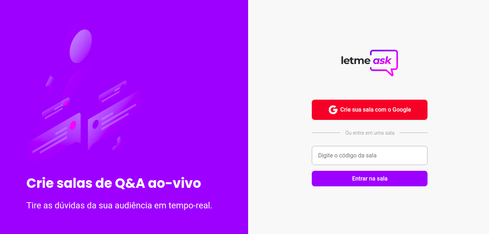

# Letmeask - NLW Together


<p align="center">
 
</p>

## :thinking: What is that about?

This is a challenge project developed in NLW together which is a programming event from [Rocketseat](https://rocketseat.com.br).

## 💻 Technologies

This repo is based in:

- [Node.js](https://nodejs.org/)
- [React.js](https://reactjs.org/)
- [Typescript](https://www.typescriptlang.org/)
- [Yarn](https://yarnpkg.com/)
- [Firebase](https://firebase.google.com/)

## 📁 Libraries

- [classnames](https://www.npmjs.com/package/classnames)
- [node-sass](https://www.npmjs.com/package/node-sass)
- [styled-components](https://www.npmjs.com/package/styled-components)

## 📋 Prototype

If you want to see the prototype of this project, [click here](https://www.figma.com/file/u0BQK8rCf2KgzcukdRRCWh/Letmeask/duplicate). 


## 🧠 Challenging myself

What I did after finishing the project:

- I put relative measurements instead of absolute ones (best front-end practices)
- I refactored the code using styled components and organizing folders properly


## 🚀 Getting Started

- Run this development server:

```bash
# for npm users
npm install
# then 
npm run start

# for yarn users
yarn
# then
yarn start
```

Made with :heart: 👨🏻‍💻